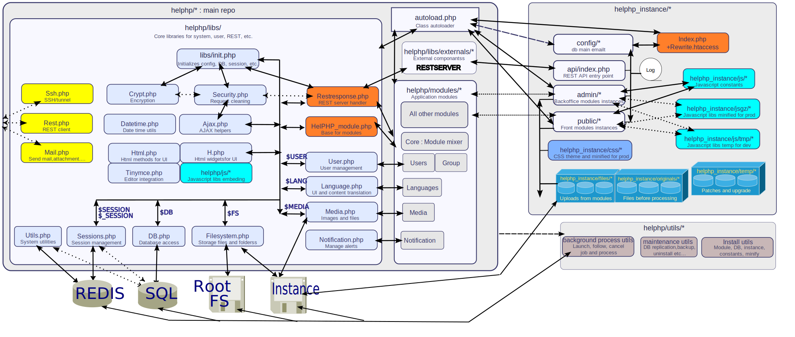

This repository is a part of the [helPHP](https://helphp.org) project, and got the same licence and contributing rules as the [main repository of helPHP](https://github.com/INRAI-helPHP/helPHP).

# HelPHP_instance

What is a HelPHP Instance ?

If you have experience in WebApp/Website creation, you know that you often use a lot's of redondant componants.

HelPHP try to reduce ressource consomption but also try to reduce maintenance tasks etc...
So if we take all the redondant componants and mutualize them on the server we can reduce disk storage usage, but also, it we take care that those componants can be OpCached by PHP, we'll win in memory, CPU and global speed of execution !

So, HelPHP is composed of a huge redondant part, the ["main repo"](https://github.com/INRAI-helPHP/helPHP) (containing the core libs, modules, and utils) that are shared between each project that are instanciating them.

So an HelPHP instance is a set of folders and small files ready to instance all those shared componants.

To help you visualize how it work, here the relations between them :

The more important to know is that all modules shared from the main repo, are called by an index.php file in admin/module_name or public_module_name folder, and if you have an exception to code or something to change, you can extend the module class in the index.php file and make it without doing any change in the main repo.

Like that you can keep up to date the main repo, host tons of project in the same server, and create exceptions when needed without breaking anything.

# Installation :

if you do not have setuped the necessary environnement, please take a look at this repo we've prepared and select your flavor of install : [HelPHP environment install](https://gitlab.com/dateam2/helphp-env-install)

simply git clone this projet on your server and git clone [helphp main repo](https://gitlab.com/dateam2/helphp) somewhere else on the same server.

If you have clone the instance in a folder ready to be served by your httpd service, just call the corresponding url for this folder + installscript.php to launch the install...

# Documentation :

Please go to [helphp.org/documentation/instance](https://helphp.org/documentation/instance)

## Donate to help us

On [helphp.org](https://www.helphp.org) homepage, you'll find a donate button. 
With it, you can make a oneshot or recurring donation to support our work.
Of course, like any team, we need some money to pay the different services (servers/domains/electricity) and when their is enough money, we can hire some help to speed up on the current WIP. 
So if you want to help up of just offer to us a little coffee, thanks in advance :)